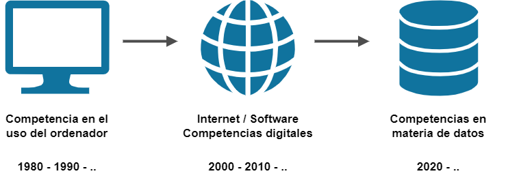
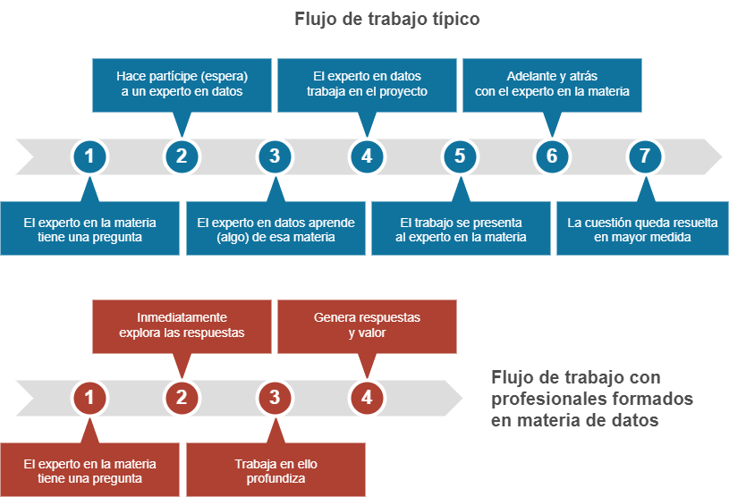

# Cultura de datos
**La importancia de adquirir competencias en materia de datos** 
   

   
Las empresas que utilizan datos para entender mejor su negocio y fundamentar sus decisiones consiguen ventajas competitivas considerables. Los datos están adquiriendo tal importancia que nos están llevando a una nueva era en la que tener conocimientos sobre esta materia resultará esencial.

Cuando surge una nueva tecnología que aporta indudables beneficios, los conocimientos para manejarla, que al principio pertenecen a unos pocos especialistas, terminan por llegar a todos.

Sucedió cuando aparecieron los ordenadores y cambiaron la manera en la que trabajamos. El ordenador se convirtió en una herramienta fundamental y saber usarlo se hizo imprescindible.

Después, con la llegada de internet ocurrió otro tanto: las llamadas _competencias digitales_ dejaron de ser un espacio exclusivo de los iniciados y se extendieron a todo el mundo.

De un tiempo a esta parte, saber manejarse con datos se está convirtiendo en una habilidad muy valorada. El mismo está dejando de ser un ámbito exclusivo de analistas, estadísticos e informáticos, para pasar a formar parte del repertorio de conocimientos que poseen profesionales de diversos campos.

En la siguiente ilustración se representa el por qué de este cambio de paradigma.
   

   
El acceso a los datos por tanto se *democratizará* en las empresas y las herramientas para realizar los análisis serán cada vez más accesibles. Incluso será posible valerse de avanzados modelos predictivos sin necesidad de programar, como bien apunta la Inteligencia Artificial generativa.

Adquirir una cultura de datos será en cualquier caso indispensable. Los profesionales deberán *alfabetizarse* en materia de datos, un aprendizaje de al menos los principios básicos de esta disciplina y una comprensión práctica de cómo utilizarla en el flujo de trabajo habitual. Porque aun disponiendo de una buena asistencia en la Inteligencia Artificial, habrá que definir especificaciones y decidir qué algoritmos se han de utilizar en cada situación, además de interpretar y validar los resultados.

Todo esto llevará tiempo. En este camino, las empresas incorporarán la tecnología de la mano de expertos en datos: analistas, científicos e ingenieros de datos. Pero se cometerá un error si la propia empresa no se forma e involucra en el proceso desde el primer momento. Los expertos en datos serán capaces de resolver los más complejos problemas que se les planteen, pero el problema será que desde la empresa no se sepan plantear las cuestiones adecuadas.

Una empresa que tome decisiones basadas en datos y no tenga los conocimientos apropiados acaba cometiendo graves errores. Los llamados _negocios inteligentes_ pueden convertirse en justo lo contrario, porque un instrumento que es capaz de amplificar la inteligencia, con un mal uso, es capaz también de amplificar las consecuencias de una mala decisión. De manera que si los involucrados en el proceso, y en especial los que toman decisiones, no tienen conocimientos sólidos de lo que tienen entre manos, los resultados pueden ser nefastos.

Al fin y al cabo, además de datos y algoritmos, la tercera pata sobre la que se sostiene el entramado de esta tecnología tiene que ver con las características del sistema, y este conocimiento clave, el del negocio, reside en la empresa. Así que la integración del personal en la cultura de datos será fundamental para que las empresas puedan beneficiarse de las ventajas que aporta el uso inteligente de los datos.

*MI, enero de 2023* 

*Fuentes:*   
https://www.datacamp.com/blog/what-does-democratizing-data-mean    
[Cassie Kozyrkov. Making Friends with Machine Learning (YouTube)](https://www.youtube.com/watch?v=1vkb7BCMQd0&list=PLRKtJ4IpxJpB_2ei8-5eWU31EZ6uSj9_s&index=7)
