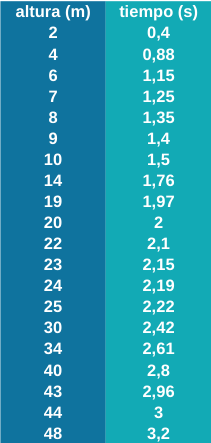
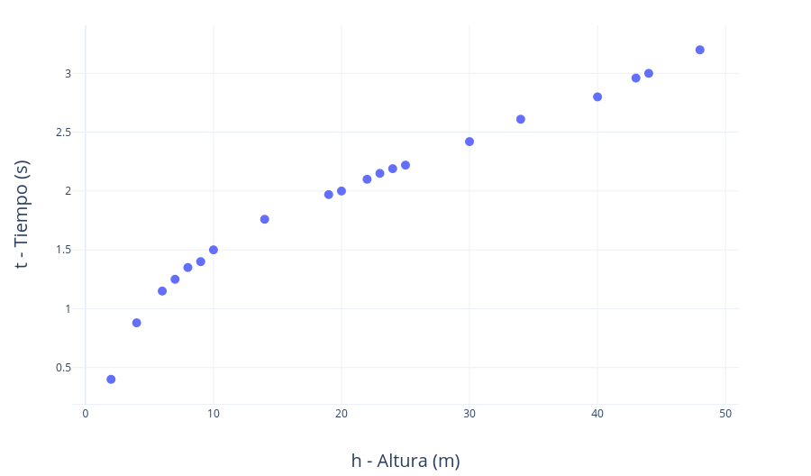
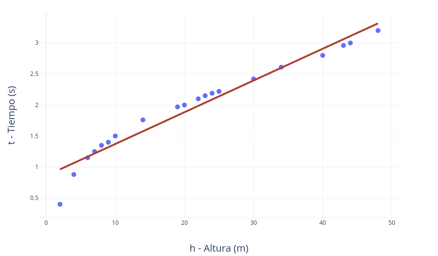
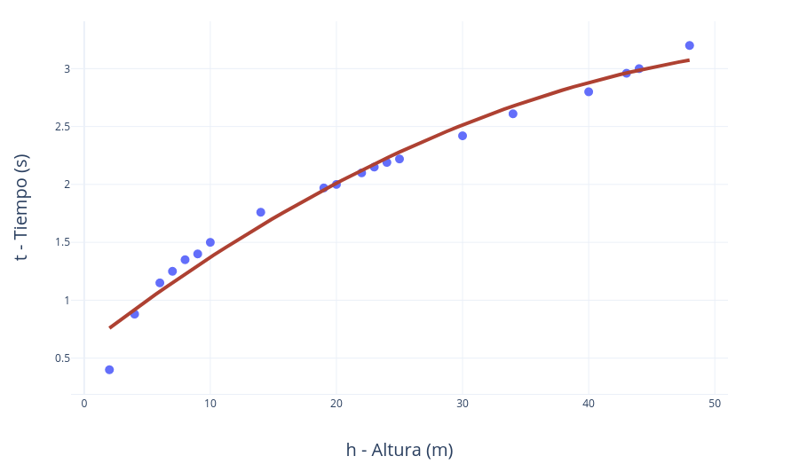
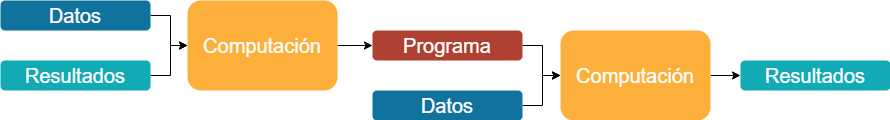
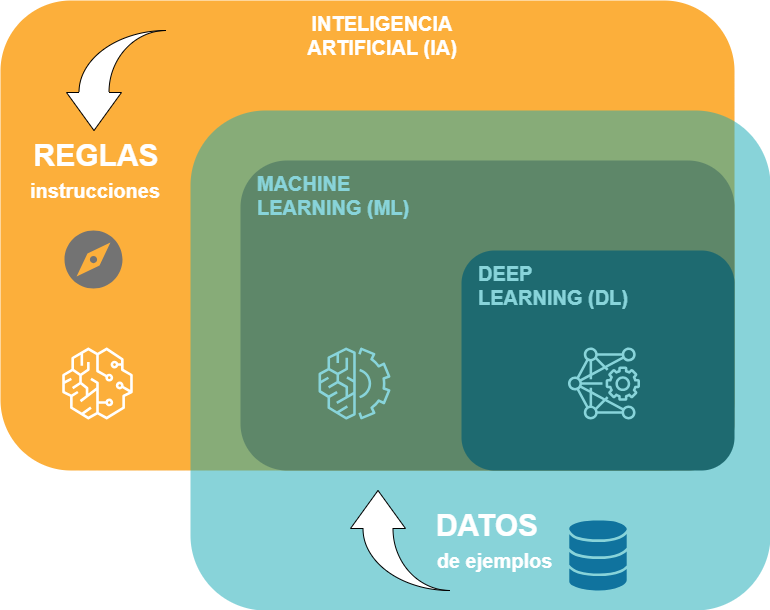
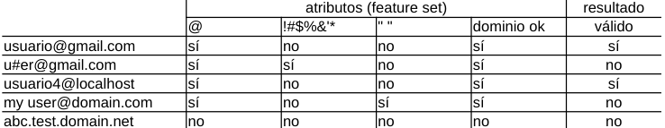
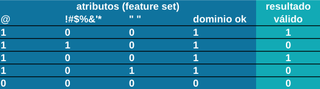

# Aprendizaje automático vs programación tradicional

{octicon}`calendar` 2024-01-19

La Inteligencia Artificial, en su sentido más amplio (esa capacidad de los ordenadores y las máquinas de realizar tareas y dar respuestas que típicamente asociamos con la inteligencia humana), se ha basado tradicionalmente en reglas. Lo habitual es programar unas instrucciones, que no es otra cosa que proporcionar al ordenador las pautas necesarias para que pueda llevar a cabo su tarea de forma automática.

Puede que esto sea suficiente si se conocen las reglas que definen el caso. Imaginemos que queremos responder a la pregunta de cuánto tiempo va a tardar en caer una bola desde cierta altura de la torre de Pisa. Las leyes que gobiernan este fenómeno son las de la cinemática, de forma que lo más sencillo sería escribir un programa que utilizara la siguiente fórmula matemática:

Donde t es el tiempo de caída, h es la altura desde la cual se suelta la bola y g es la aceleración debido a la fuerza de la gravedad. Por ejemplo, introduciendo en la ecuación una altura de h=16 metros la bola tardaría unos 1,8 segundos en caer al suelo (t = (2 x 16 / 9.8)1/2 ≈ 1,8).

&nbsp;

&nbsp;

Ahora imaginemos que no hemos descubierto aún las leyes de la física y por tanto nos resulta imposible escribir el programa que contempla dicha regla. Podríamos entonces realizar los experimentos que llevó a cabo Galileo en su día y anotar en una tabla los resultados obtenidos para después dibujar una gráfica:

&nbsp;

 

&nbsp;

Ahora bien: ¿cuánto tardará la bola en caer de una altura de 16 metros? Nos falta justo esa medición, por lo que necesitaríamos un modelo que describa el sistema para responder a esta pregunta.

En primera aproximación podríamos utilizar como modelo una sencilla línea recta (y = a x + b). Ajustándola manualmente para que se acerque lo máximo posible a los valores experimentales, obtenemos una línea recta con los siguientes parámetros específicos de pendiente (a) y ordenada (b).

t = 0,055 h + 0,75

&nbsp;

&nbsp;

Introduciendo en la ecuación h=16, el resultado es de t=1,63 segundos.

Si hiciéramos el experimento desde los 16 metros, el resultado real nos indicaría que el modelo lineal que hemos utilizado no es muy preciso. Si quisiéramos afinarlo, en lugar de una sencilla recta podríamos utilizar una ecuación de segundo grado (y2 = a x) buscando unos parámetros que lo hicieran aproximarse más a los puntos de medición.

t2 = 0,2 h → t = (0,2h)1/2

&nbsp;

&nbsp;

Introduciendo en la ecuación h=16, el resultado es de aproximadamente t≈1,8 segundos, que es justo lo que obtenemos experimentalmente y también con la fórmula cinemática, pues lo que hemos encontrado mediante este proceso de aproximación es precisamente la regla física que define el fenómeno.

Con todo este proceso de recopilar datos experimentales y deducir a partir de ellos una regla (un modelo con sus parámetros) lo que hemos estado haciendo ha sido aprender del sistema y definir el programa (la fórmula) que nos hará los cálculos en adelante. **Cuando este proceso de aproximación lo realizan ciertos algoritmos de forma automática, entonces estamos ante lo que entendemos por aprendizaje automático a partir de los datos, conocido también como Machine Learning**.

&nbsp;

&nbsp;

Por tanto, la inteligencia puede ser programada en las máquinas si las reglas son conocidas. Y si no lo son, las tecnologías de Machine Learning (y las más avanzadas de Deep Learning), englobadas dentro del paraguas general de la Inteligencia Artificial, permiten descubrir esas reglas y caracterizar el problema utilizando para ello datos de ejemplo.

&nbsp;

&nbsp;

Veamos otro ejemplo en el que podamos comparar la forma convencional de programar un sistema y la alternativa de que sea el propio sistema quien aprenda las reglas de dicho programa empleando para ello técnicas de aprendizaje automático.

El ejemplo anterior de la caída de objetos desde la torre de Pisa era un problema sencillo en el que se buscaba un valor numérico (el tiempo de caída) y en el que los datos de partida eran de una sola dimensión (la altura, una sola columna de datos). En el siguiente problema de ejemplo se buscará una respuesta binaria (sí o no) y por tanto será un ejercicio de los llamados de clasificación. Y será además multidimensional, es decir, la tabla de datos tendrá múltiples columnas.

Supongamos que queremos que el sistema identifique si una cadena de caracteres es una dirección válida de email o por el contrario no lo es. Primero de todo deberíamos definir qué entendemos por una dirección válida de email, estas son unas posibles reglas simplificadas:

- La arroba (@) debe estar presente.
- El nombre de usuario no debe contener caracteres especiales (!#$%&’*).
- El nombre de usuario no debe contener espacios en blanco.
- En la parte de dominio debe cumplir con los requerimientos estándar.

Escribir un programa, en cualquier lenguaje de programación alto nivel, que contemple estas reglas y dé un resultado es una tarea sencilla:

_SI email CONTIENE @ Y NO CONTIENE !#$%&’* Y NO CONTIENE espacios
Y cumple_requerimientos_dominio
ENTONCES resultado = válido
SI NO resultado = no_válido_

Sin embargo, podríamos no escribir dichas reglas y dejar que sean los algoritmos de aprendizaje automático quienes las descubran. Los algorimos de Machine Learning aprenderán buscando las pautas que siguen los ejemplos que les proporcionemos. Para ello, los datos de ejemplo tendrán que presentarse de manera que distingan lo que es un resultado correcto de lo que no lo es.

&nbsp;

&nbsp;

Por tanto, para resolver el problema de los email válidos tenemos que crear una tabla de datos de ejemplo (training data) de lo que son direcciones de email válidos y no válidos de tal manera que reflejen las reglas que hay detrás. En ella, las direcciones de email de ejemplo se traducen en atributos (features), que son las que se utilizan para alimentar el algoritmo.

&nbsp;

&nbsp;

Esta tabla debería construirse identificando los atributos críticos que establecen lo que es un email válido del que no lo es. Debería asimismo contener abundancia de ejemplos (multitud de filas) de manera que el algoritmo pueda deducir (aprender) las reglas.

Si las reglas cambiaran en cierto momento, en el escenario de la programación convencional tendríamos que modificar el programa escrito. En el caso del aprendizaje automático, deberíamos entrenar el algoritmo con los nuevos datos de manera que se actualizara su respuesta.

Resumiendo, en el caso de los problemas en los que se dispone de un conjunto de reglas concretas que gobiernan la lógica o el fenómeno, la programación convencional puede ser la forma óptima de solucionarlos. El aprendizaje automático encuentra su aplicación en situaciones en las que no existen dichas reglas, o no están bien definidas, problemas complejos en los que, a falta de instrucciones o normas, los algoritmos buscan patrones en los datos para aproximar un resultado.

---
(Imagen de portada de T Hansen en Pixabay.)