# ¿Cómo funciona el aprendizaje profundo?

{octicon}`calendar` 2024-06-24

Lo cierto es que nadie lo sabe, esta es la sorprendente respuesta. A ciencia cierta, no se sabe lo que sucede en el fondo de un algoritmo de **aprendizaje profundo** o **Deep Learning**.

Como método de **aprendizaje automático** que es, se plantea para que capture los patrones existentes en los datos de ejemplo con que se alimenta durante el entrenamiento. Y como en el resto de sistemas de **Machine Learning**, el algoritmo busca los parámetros que minimizan el error durante este aprendizaje. Pero a diferencia de los sistemas clásicos de aprendizaje automático, en Deep Learning las reglas que determinan el comportamiento del conjunto no están escritas, se vuelven demasiado complejas para definirlas analíticamente. Por ello, el desarrollo de estos modelos se ha basado en el método de probar y ver qué pasa, seleccionando los métodos y las arquitecturas que experimentalmente mejores resultados han dado. Pero sin saber por qué.

Y sin embargo, el concepto en el que se fundamentan es muy sencillo.

## Interacciones

Imaginemos que trabajamos para un banco y necesitamos construir un modelo para predecir las transacciones que cada cliente llevará a cabo el año que viene. Disponemos de una tabla de datos con los resultados de este año, una lista con atributos de los clientes y el número de transacciones al que dieron lugar en cada caso.

&nbsp;

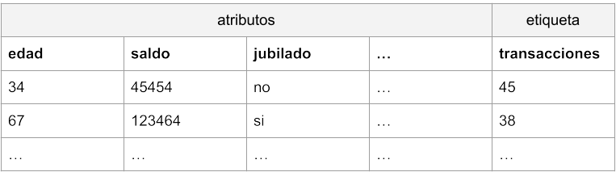

&nbsp;

Podemos plantear un algoritmo sencillo de aprendizaje automático, por ejemplo el de regresión lineal. En este caso asumiríamos que cada atributo tiene su propia influencia en el resultado final, un efecto que se puede representar de la siguiente manera:

transacciones_previstas = ordenada + pendiente1 * edad + pendiente2 * saldo + pendiente3 * jubilado + …

En el caso de la regresión lineal, el algoritmo de aprendizaje se encargaría de lograr los valores de los parámetros de pendientes y ordenada, de manera que pudiéramos predecir el resultado de número de transacciones para nuevos datos de entrada. Otra forma de representar lo mismo sería la siguiente:

&nbsp;

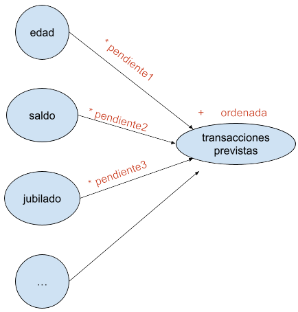

&nbsp;

Supongamos, para simplificar, que hemos encontrado que la edad no tiene influencia alguna en el resultado, podemos por tanto eliminar esa columna. Asimismo, comprobamos que solamente el saldo y el hecho de ser o no ser jubilado contribuyen en el número de transacciones realizadas. Llamemos w (por _weight_, peso) a los valores de pendiente por los que los multiplicamos, y llamemos b (por _bias_) a la ordenada.

&nbsp;

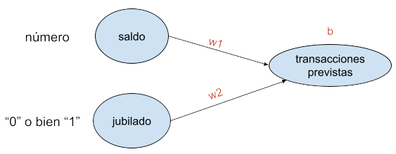

&nbsp;

La regresión lineal así planteada, siguiendo la fórmula (transacciones_previstas = b + w1 * saldo + w2 * jubilado) y considerando que la variable «jubilado» toma un valor «0» o bien «1», predeciría resultados de este tipo:

&nbsp;

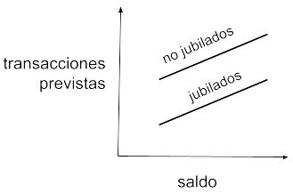

&nbsp;

Donde la pendiente de ambas rectas sería w1, la ordenada de los no jubilados b, y la de los jubilados b + w2.

Pero esta predicción podría resultar poco precisa. Supongamos que los jubilados tienden a comportarse de forma distinta dependiendo de su saldo en cuenta. Por ejemplo, consideremos que los jubilados con mucho dinero hacen casi tantas transacciones como los que están trabajando, mientras que los jubilados con menos dinero apenas las hacen. Es decir, la realidad se acercaría más a una representación gráfica como esta:

&nbsp;

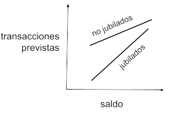

&nbsp;

Las transacciones no solo dependerían del saldo y de estar o no jubilado, sino del saldo y de una función combinada que tendría en cuenta ese saldo y la condición jubilada del cliente. Para ello, el modelo de regresión lineal anterior es demasiado simple y no puede plasmar esta dependencia adicional. Necesitaríamos algo así:

&nbsp;

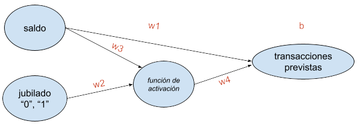

&nbsp;

La **función de activación** puede ser sencillamente una puerta que permita la propagación de la señal cuando la entrada proveniente de jubilado = 1 esté por encima de un umbral, y no la permita cuando la entrada propiciada por jubilado = 0 esté por debajo de ese umbral. Exactamente lo que hace **una neurona en nuestro cerebro**.

&nbsp;

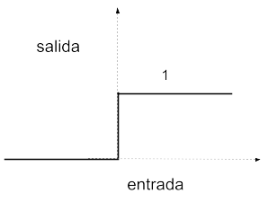

&nbsp;

En este caso:

_Para no jubilados_: transacciones_previstas = b + w1 * saldo  
_Para jubilados_: transacciones_previstas = (b + w2 * w4) + (w1 + w3 * w4) * saldo

Es decir, dos rectas con pendientes y ordenadas diferentes, tal y como se presenta en la realidad.

De manera que lo que hemos conseguido añadiendo esa capa intermedia (consistente en una función de activación a la que se le denomina **neurona**) es que el modelo tenga en cuenta, además del saldo, una **interacción** entre dicho saldo y la condición de jubilado del cliente. Con ello logramos que el modelo sea más flexible y haga predicciones más certeras.

## Redes neuronales

En esencia, una red neuronal básica consistiría en añadir una capa intermedia compuesta por funciones de tipo neurona entre las entradas y las salidas de un modelo, lo cual permitiría contemplar la influencia que tienen en el resultado las interacciones entre los atributos.

&nbsp;

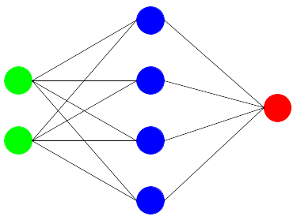

&nbsp;

Se compone así de una capa de entrada, que son los atributos del modelo, una capa oculta, la de las neuronas, y una capa de salida, la de las etiquetas. Una vez fijada la arquitectura en cuanto a número de neuronas y sus funciones de activación, el modelo quedaría definido mediante los parámetros de pesos (w) a multiplicar y bias (b) a sumar.

&nbsp;

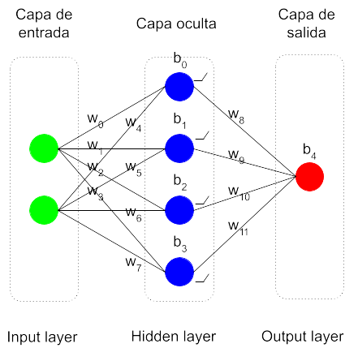

&nbsp;

El entrenamiento o aprendizaje de la red neuronal consiste en utilizar un algoritmo que encuentre los valores óptimos para todos estos parámetros w y b, siguiendo el criterio de minimizar el error cometido en los datos de ejemplo. Se parte de unos parámetros con valores aleatorios y se llevan a cabo los cálculos. Se computa el error cometido y se recorre la red en sentido inverso (**backpropagation**) deduciendo para los parámetros unos valores nuevos que permitan disminuir dicho error. Este proceso de recorrer la red hacia adelante y hacia atrás se repite las veces que sean necesarias, hasta lograr unos valores estables que den unos resultados satisfactorios. Una vez lograda la parametrización final, el modelo estaría listo para ser utilizado en predicciones.

## Deep Learning

¿Redes neuronales (Neural Networks) o Deep Learning (aprendizaje profundo)?

Son términos prácticamente sinónimos. En principio, Deep Learning hace referencia a redes neuronales de más de una capa de neuronas: **Deep Neural Networks**. Y como son sistemas de aprendizaje automático o Machine Learning, Deep (Neural Networks) Learning, que para acortar se quedó en Deep Learning.

Deep Neural Networks fue un nombre que surgió en tiempos en los que no había mucha capacidad de computación y disponer de una red neuronal con más de una capa intermedia era un sueño. Más de dos capas era una quimera. Hoy en día todas las redes neuronales tienen múltiples capas, decenas, cientos, podrían tener miles, de manera que todas son _profundas_.

&nbsp;

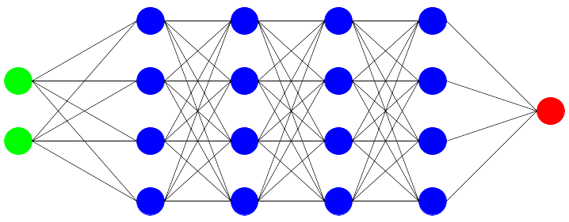

&nbsp;

Se trata por tanto de capas de transformaciones matemáticas, capas y capas, una detrás de otra. Nada mágico. Y sin embargo, los resultados que dan parecen magia.

Las transformaciones matemáticas que se producen en conjunto (transformaciones de transformaciones de transformaciones…) enseguida se complican enormemente y no resulta posible decir qué hace cada una de esas neuronas una vez terminado el aprendizaje. Por eso no se entienden las redes neuronales, a pesar de que en esencia, el mecanismo es sencillo. Definirlos resulta imposible y de ahí que no haya reglas en cuanto al número de capas y de neuronas que conviene definir en cada caso.

## Extracción automática de atributos

Las redes neuronales profundas son mecanismos tan flexibles que se adaptan a cualquier realidad compleja, como la que viene en forma de los llamados **datos no estructurados** (los que no se pueden trasladar fácilmente a una tabla de datos), como son las imágenes, el lenguaje, los sonidos y los vídeos.

Veamos un ejemplo de aplicación en reconocimiento de imágenes. Supongamos que queremos construir un modelo que sea capaz de leer imágenes de cifras manuscritas en escala de grises. Para simplificar, las imágenes tendrán muy poca resolución: 8 x 8 pixeles.

&nbsp;

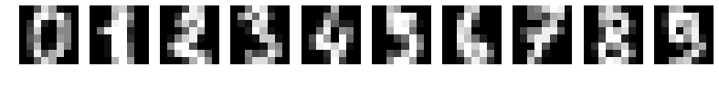

&nbsp;

Una posible arquitectura podría ser la siguiente:

&nbsp;

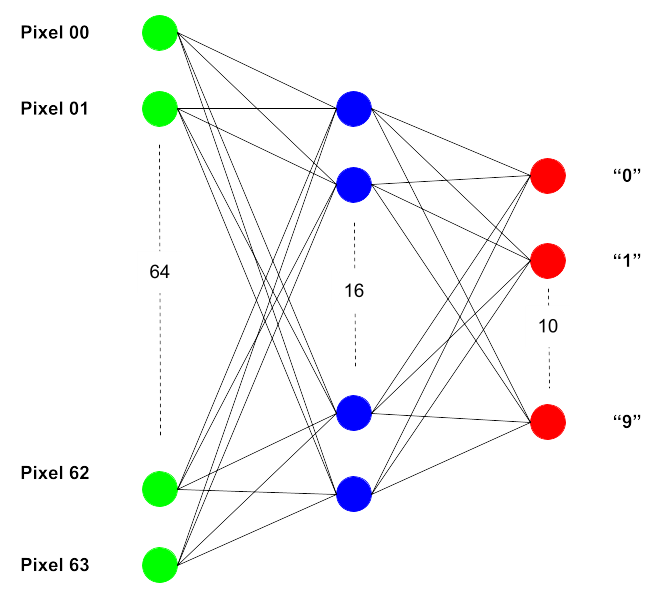

&nbsp;

Los valores de cada pixel de los 64 que hay en total entrarían por su correpondiente nodo. Se plantea una sola capa interna compuesta por 16 neuronas, y la salida está compuesta por nodos que dan un valor, por ejemplo, entre 0 y 1, considerando el nodo que es activado aquel que logra mayor índice entre los 10.

Lo maravilloso de una red neuronal es que no hay que indicarle qué características de los números tiene que atender para que se aproxime en su pronóstico. Es un sistema tan flexible que se encarga él mismo de buscar los atributos formales que diferencian una cifra de otra. Esta es una de las grandes diferencias que existen entre el Deep Learning y el Machine Learning clásico.

Sin embargo, esto no sale gratis. Cuanto más complejo sea el sistema, mayor cantidad de datos de ejemplo se requiere para poder ser entrenado. Y de una capacidad de computación igualmente potente para que el aprendizaje no se eternice. Si no disponemos de datos suficientes, sencillamente no tiene sentido emplear estos sistemas.

Otro aspecto que se resiente en las redes neuronales es la **interpretabilidad**, tal como se ha indicado ya. El sistema es capaz de identificar las formas que hacen que una imagen muestre una cifra y no otra, pero no sabemos cómo lo hace. Suponemos que detecta las esquinas, las transiciones entre píxeles, pero no la manera en la que lo hace. Es una caja oscura. Por ello, dependiendo de la complejidad del caso, el algoritmo podría detectar en las imágenes información insospechada dando un resultado imprevisto y erróneo. Así que es necesario comprobar con cuidado que los datos de ejemplo sean los adecuados para que el sistema aprenda según lo previsto.

## Conclusiones

La mayor ventaja de los modelos de aprendizaje profundo es que son extremadamente flexibles y se pueden adaptar a las tareas más complejas.

Sin embargo, son tan flexibles que con ellos se corre un mayor riesgo de **sobreajuste** (**overfitting**), que es lo que sucede cuando el modelo empieza a aprender particularidades de los datos de ejemplo que no generalizan bien en datos nuevos. Es decir, aprende de memoria un comportamiento, pero no el patrón que mejor describe un fenómeno, de forma que yerra a la hora de predecir el resultado para casos nuevos.

Dado el esfuerzo que requieren, las redes neuronales es mejor utilizarlas solo cuando se sabe de antemano que los métodos tradicionales de Machine Learning no funcionarán, como en los mencionados casos en los que los datos consisten en imágenes, lenguaje, sonido o vídeo. Y aunque sean datos estructurados en una tabla, si se sabe que los atributos tienen entre sí relaciones intrincadas, podría ser también una buena idea tirar por el Deep Learning.

La arquitectura óptima (el número de capas ocultas y la cantidad de neuronas en cada una de ellas) suele ser desconocida al principio y lo mejor es empezar suave, con sistemas pequeños, para minimizar el riesgo de sobreajuste. A partir de aquí se trata de probar e ir viendo los resultados obtenidos con cada diseño.

---
(Imagen de portada de Gerd Altmann en Pixabay.)