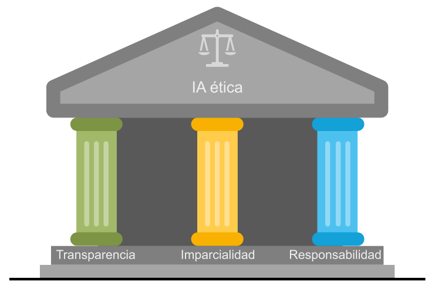
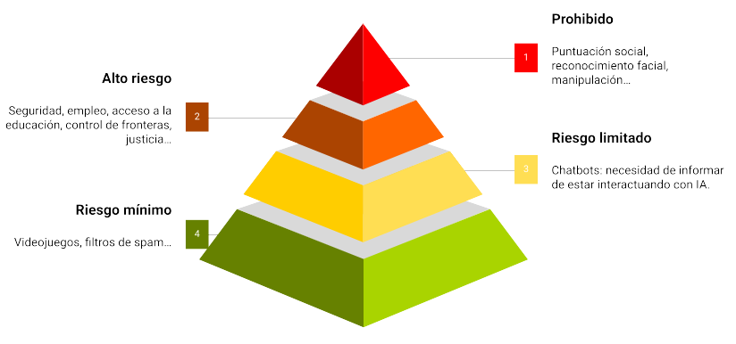

# Ética en la IA

{octicon}`calendar` 2024-07-04

Los tres principios básicos que sustentan el comportamiento ético en el uso de la Inteligencia Artificial son la **imparcialidad**, la **responsabilidad** y la **transparencia**.

&nbsp;

&nbsp;

## Imparcialidad

El principio de imparcialidad implica que los sistemas de IA deberían ser **justos** y tratar por igual a todas las personas evitando cualquier forma de **discriminación**. Es importante reflexionar acerca de los **sesgos** que podrían incorporar los datos con los que se entrenan los modelos. El peligro con la utilización de los algoritmos a escala es que podrían magnificar las decisiones injustas.

A veces el error viene del hecho de no contemplar datos suficientemente representativos de toda la población. También puede surgir por reflejar fielmente una realidad que de por sí es injusta, al fin y al cabo los modelos reproducen los patrones contenidos en los datos.

Una manera de abordar este problema es omitir en los datos los atributos que típicamente dan lugar a resultados discriminatorios, como son la raza, el género, la edad o el estatus socioeconómico. Pero incluso así, los potentes modelos de aprendizaje profundo pueden deducir características diferenciadoras que se corresponden con las clases que se han querido opacar, de manera que no suele ser sencillo eliminar los sesgos.

Ser conscientes de este tipo de injusticias que se producen es fundamental para mantener una mirada escéptica y vigilante con respecto a la IA, siendo necesario monitorizar los resultados y hacer auditorías regularmente.

## Responsabilidad

En caso de que el sistema de IA cometa un error, ¿de quién es la responsabilidad? ¿De la empresa que implementa el sistema inteligente, del que lo emplea (supuestamente mal), del proveedor de la solución, del que la desarrolló? La situación se presta a que se echen las culpas los unos a los otros (¡cuando no a la propia IA!).

El principio de responsabilidad establece que alguien debería asumir el compromiso de **hacerse cargo** y las figuras que vayan a responder en cada tipo de problema deben estar bien claras. Saber que hay alguien ahí que se hace responsable de las decisiones que toma la IA favorece la confianza de los usuarios.

## Transparencia

Las decisiones tomadas por la IA deberían ser **comprensibles** y **explicables**, así se evitan las suspicacias y se refuerza la confianza en las empresas que ofrecen y utilizan la tecnología. Para ello se debería compartir el conocimiento y la información sobre los sistemas en funcionamiento.

Muchas de las aplicaciones de IA se consideran cajas negras: lo que sucede entre las entradas y las salidas es un misterio. Igual que en nuestro cerebro: podemos saber lo que percibimos y lo que expresamos, pero el proceso cognitivo intermedio resulta ambiguo. Y desde un punto de vista ético, la ambigüedad es mala. ¿Cómo podemos confiar en las decisiones que toma la IA si no entendemos el procedimiento que emplea para llegar a ellas? ¿Cómo asegurar que no estamos saltándonos los reglamentos o sobrepasando los límites morales?

## XAI: la IA inteligible

XAI (_Explainable AI_) hace referencia a la Inteligencia Artificial cuyos mecanismos internos son comprensibles para los humanos. No solo se trata de desarrollar sistemas de IA que sean precisos y autónomos, sino de hacerlos entendibles, para que podamos descifrar cómo y por qué llegan a ciertas conclusiones.

La práctica del XAI toma dos formas diferentes. La primera de ellas promueve la utilización de **modelos interpretables**. Los modelos de aprendizaje automático denominado «clásico» suelen ser en muchos casos interpretables. En los algoritmos de regresión lineal, regresión logística o los árboles de decisión, por ejemplo, se puede seguir el camino que recorren las entradas hasta dar con la salida. Estos modelos a menudo no dan un resultado tan preciso como otros modelos más complejos, pero a cambio son legibles.

En sistemas más sofisticados en los que no es posible seguir la pista directamente, el concepto XAI puede ser implementado como una capa de software que dé voz al modelo para que nos narre su proceso de decisión. Imaginemos que usamos un algoritmo avanzado para predecir el éxito de una película. Una técnica común de interpretabilidad es la LIME (Local Interpretable Model-agnostic Explanations), una arquitectura que se puede ver como un traductor que ayuda al modelo a comunicar su razonamiento: crea un esquema más simple de su proceso de toma de decisión. Por ejemplo, el modelo podría predecir el éxito para un filme, y la LIME explicaría que es por su famoso director y gran presupuesto.

En esta misma línea existe otra técnica llamada SHAP (SHapley Additive exPlanations), que trabaja como un detective revelando la importancia relativa de cada atributo en la solución al problema predictivo. Por ejemplo, SHAP indicaría que el director fue el causante del 50% en el resultado predicho, el reparto de un 30%, el género de un 15% y el presupuesto de un 5%.

## Regulación de la IA

La [Ley de Inteligencia Artificial de la Unión Europea](https://artificialintelligenceact.eu/es/high-level-summary/) (EU AI Act) es un reglamento aprobado en 2024 por medio del cual se establecerá un marco normativo y jurídico para los sistemas de IA que operen en la Unión Europea. Su objetivo es disminuir los riesgos que supone esta tecnología para la seguridad europea y los derechos fundamentales de los ciudadanos. En este sentido, sus postulados se alinean con los principios éticos ya mencionados.

El Reglamento clasifica las aplicaciones de inteligencia artificial en función de su riesgo:

&nbsp;

&nbsp;

- Se prohíben los riesgos **inaceptables** como los sistemas de puntuación social y la IA manipuladora. Por ejemplo, no se podrán hacer bases de datos con datos de reconocimiento facial ni se podrá catalogar a la población según su raza, creencias, etc.
- La mayor parte del texto aborda los sistemas de IA de **alto riesgo**, que están regulados. Por ejemplo los que realizan perfiles, es decir, el tratamiento automatizado de datos personales para evaluar diversos aspectos de la vida de una persona, como su rendimiento laboral, su situación económica, su salud, sus preferencias, sus intereses, su fiabilidad, su comportamiento, su ubicación o sus movimientos. Para estos casos se obliga a tener sistemas de supervisión humana, gestión de riesgos, de calidad, gobernanza de los datos, ciberseguridad, registro, etc, todo lo cual debe incluirse en una documentación que demuestre la conformidad con los postulados de la ley.
- Una sección más pequeña se ocupa de los sistemas de IA de **riesgo limitado**, sujetos a obligaciones de transparencia más ligeras: los desarrolladores e implantadores deben garantizar que los usuarios finales sean conscientes de que están interactuando con IA.
- El **riesgo mínimo** no está regulado, aunque se prevé un código de conducta voluntario.

Se trata de la primera ley en el mundo sobre IA y, al igual que sucedió con el Reglamento General de Protección de Datos (RGPD), podría convertirse en una referencia mundial para otros países que quieran legislar sobre la inteligencia artificial.

## El valor de la IA ética

Los usuarios nos podemos preguntar por el tratamiento que reciben nuestros datos y por la influencia que las herramientas de IA tienen sobre nuestras decisiones. Por ello, independientemente de los reglamentos de obligado cumplimiento, las empresas que adopten tempranamente prácticas éticas es de esperar que se beneficien en términos de imagen corporativa. Además, estarán protegidas en caso de que esta tecnología, aún incipiente, conduzca a un resultado inadvertidamente inapropiado (con el peligro consiguiente de dañar la marca).

Las grandes oportunidades vienen a menudo acompañadas de grandes riesgos si no se hacen las cosas bien. La IA ética es lo que permite a las organizaciones equilibrar los beneficios de estas nuevas tecnologías con las incertidumbres que conllevan. De manera que su implementación no sería solamente una estrategia defensiva, sino también una apuesta por lograr ventaja competitiva en un mercado cada vez más concienciado en aspectos éticos. Las empresas que cuiden la integridad en el uso de la IA serán percibidas como entidades fiables, lo que se traducirá en fidelidad y en reputación para las mismas.

---
(Imagen de portada de Engin Akyurt en Pixabay.)