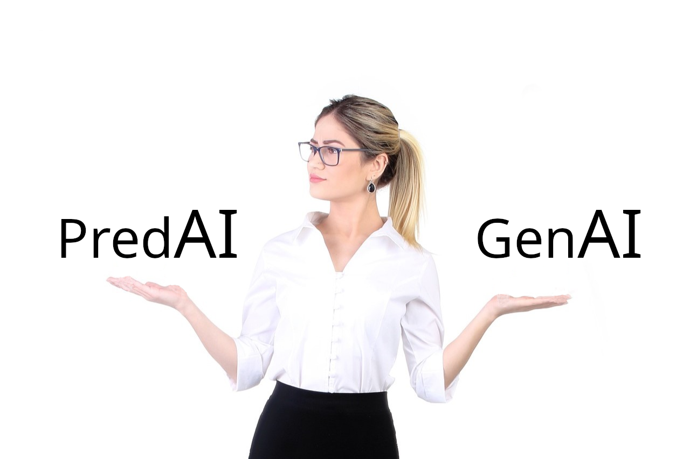
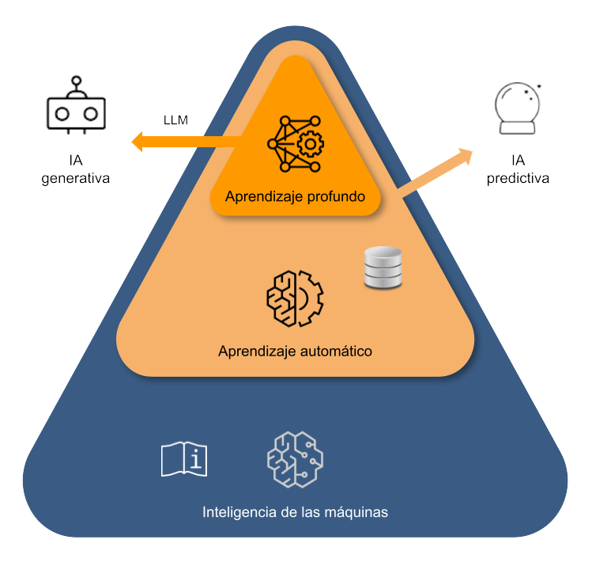
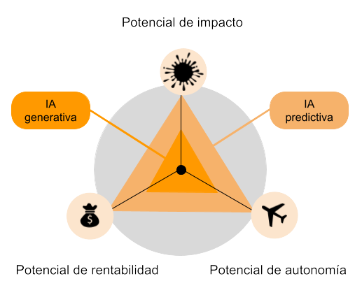

# IA predictiva vs IA generativa

{octicon}`calendar` 2024-06-30

La aparición de los modelos de aprendizaje profundo que son capaces de generar contenido (ya sea en forma de texto, de imágenes o de sonido), ha venido acompañada de aplicaciones que nos han permitido interactuar directamente con ellos (como por ejemplo el bot conversacional ChatGPT). Mediante estas interfaces hemos podido comprobar de primera mano su potencia y nos hemos quedado prendados de sus capacidades.

Por primera vez, a muchos nos ha dado la impresión de estar comunicándonos con una máquina como si nos encontráramos frente a otro ser humano, obteniendo unas respuestas que hasta ahora han estado reservadas a las personas en lo que respecta al uso del lenguaje, la creatividad o el razonamiento. No es de extrañar por tanto que una de las consecuencias directas de este fenómeno, tan expandido, haya sido la adopción popular del término **IA** (**Inteligencia Artificial**) para referirse a esta nueva entidad.

Sin embargo, con esta denominación se ha creado cierta confusión, porque históricamente, la IA ha hecho referencia a diferentes campos de la tecnología de computación.

&nbsp;

&nbsp;

## La IA en su sentido más amplio

La aparición de los primeros ordenadores a finales de los años cincuenta del pasado siglo y las expectativas que despertaron dieron lugar al término «Inteligencia Artificial», tal y como describo [aquí](https://datuz.es/2023/05/26/que-es-la-inteligencia-artificial/), donde recorro la evolución que siguió esta expresión desde su origen en la programación basada en reglas hasta las técnicas de aprendizaje a partir de datos (aprendizaje automático o Machine Learning).

En ese artículo explico que, mientras la tecnología en torno al aprendizaje de los datos iba desarrollándose, el término «Inteligencia Artificial» fue evitado para referirse a los sistemas inteligentes. De alguna manera, (quizá a causa de los libros y las películas de ciencia ficción) dicha locución se vio en su momento asociada a una forma de inteligencia superior, comparable a la de los humanos, y los avances en ciencias de computación no daban para tanto, ya fuera en cuanto a modelos como sobre todo en lo que respecta a las capacidades de procesamiento de los ordenadores. De hecho, se veía poco serio llamar «IA» a la tecnología disponible.

## La IA asociada a la redes neuronales

Esta situación fue cambiando cuando un tipo específico de modelo, el de las **redes neuronales**, empezó a despegar hacia 2010. A diferencia del aprendizaje automático clásico, las redes neuronales se inspiraban en el funcionamiento del cerebro humano y aportaban unos resultados más penetrantes. La teoría en la que se basaban era ya conocida de antes, pero, solamente con la disponibilidad de un montón de datos provenientes de Internet y los avances en potencia de computación, pudieron empezar a sacarles rendimiento.

Los modelos en redes neuronales se hicieron tan complejos que se volvieron «profundos» (**Deep Learning, aprendizaje profundo**) y ya no se sabía interpretar qué sucedía dentro de ellos, con qué criterios tomaban sus decisiones. Pero eran muy flexibles y tremendamente precisos. Además, la arquitectura de neuronas, que semejaba el funcionamiento al cerebro humano, hizo que el término **Inteligencia Artificial** se volviera a emplear para referirse a ellos. Porque de hecho empezaron a hacer cosas tan complejas como clasificar imágenes, traducir lenguajes o transcribir sonidos.

## La IA asociada a la IA generativa

Los modelos de aprendizaje profundo siguieron evolucionando, tal y como escribo en esta otra [entrada](https://datuz.es/2024/01/24/que-es-la-inteligencia-artificial-generativa/). La combinación de nuevas arquitecturas y la disponibilidad de más datos y mayores capacidades de procesamiento dieron lugar a los primeros modelos grandes de lenguaje (**LLM, Large Language Models**) a finales de la década de 2010. Una vez entrenados en un corpus inmenso de datos provenientes de Internet, su cometido fundamental era predecir la siguiente palabra a incorporar en una frase, de manera que la misma tuviera sentido en el contexto en el que dicho enunciado se produjera. Ello permitió que los humanos pudiéramos por primera vez mantener una conversación con sentido con una máquina.

En este punto (con la aparición de ChatGPT y otras herramientas a finales de 2022) es donde empezó a surgir la denominación de la IA Generativa. Los modelos grandes de lenguaje no hacían otra cosa que predecir de la forma más certera posible la siguiente palabra que correspondía en cada punto dentro de una conversación, pero _lo hacían teniendo en cuenta el sentido del conjunto_, de manera que era como si estuvieran creando contenido. De hecho, en términos efectivos, así era. De forma que, de esta manera tal sutil, se pasó de un esquema típico de predicción (predicción de «palabras» en este caso) a otro en el que dichas predicciones daban lugar a un contenido totalmente nuevo.

La designación como «generativa» para estos potentes modelos de aprendizaje profundo se fijó definitivamente cuando los LLM y la comunicación humano-máquina que posibilitaban, se combinó con modelos avanzados que permitían crear nuevas imágenes o sonidos por medio de arquitecturas igualmente basadas en último término en redes neuronales y en su predicciones.

## La necesidad del término «IA predictiva»

Actualmente por tanto, debido al boom de los modelos generativos, cuando empleamos la expresión «Inteligencia Artificial», a menudo nos estamos refiriendo a este tipo de tecnología, la IA generativa. Sin embargo, los modelos de aprendizaje automático, tanto los clásicos como los de redes neuronales, siguen vigentes. A diferencia de las construcciones gigantes de los modelos generativos, los puramente predictivos son modelos más pequeños y eficientes cuando de lo que se trata es de hacer predicciones concretas en cierta aplicación.

De manera que se vio la necesidad de incorporar al vocabulario un nuevo término que identificara todo este terreno que se ha venido transitando anteriormente y en el que se fundamenta todo, para diferenciarlo del nuevo boom de la IA Generativa. Y se le dio en llamar **Inteligencia Artificial Predictiva**, que no es otra cosa que el Machine Learning: el aprendizaje automático a partir de datos de ejemplo para crear un modelo con el que predecir etiquetas desde datos nuevos.

## IA predictiva vs IA generativa

¿En cuál de estos dos tipos de tecnología deberían centrarse las empresas? ¿En la generativa, que produce textos, programas, vídeos, imágenes y demás contenido? ¿O en la predictiva, que se orienta a optimizar tareas en marketing, producción, cadena de suministro, detección de fraude, gestión del riesgo, tratamiento de salud y demás aplicaciones típicas de predicción?

Según explica Eric Siegel en su artículo [3 Ways Predictive AI Delivers More Value Than Generative AI](https://www.forbes.com/sites/ericsiegel/2024/03/04/3-ways-predictive-ai-delivers-more-value-than-generative-ai/) («3 formas en las que la IA predictiva produce más valor que la IA generativa»), en lugar de seleccionar una tecnología atractiva para después buscar el problema a solucionar, deberíamos centrarnos en identificar primero el problema y después buscar la solución óptima para el mismo. La IA es una herramienta, no es un fin. Pensar de otra manera que no sea la de preguntarse primero dónde se puede mejorar y buscar después la tecnología adecuada, es caer en los peligros del bombo publicitario que acompaña en estos momentos al término «Inteligencia Artificial» y el probable fracaso de las iniciativas que se emprendan en este campo.

La IA generativa y la IA predictiva conducen hacia propósitos diferentes. La generativa se orienta hacia tareas que normalmente realizan las personas. La predictiva por su parte persigue objetivos que en principio parecen menos ambiciosos pero que tienen un gran impacto: optimiza procesos a gran escala en la empresa. Esto significa que, a día de hoy, mientras que la generativa puede impresionar más, es la predictiva la que seguramente proporciona más beneficios en cuanto a la eficiencia de las empresas.

La IA predictiva disfrutaría de tres grandes ventajas con respecto a la generativa:

1. **Mayor retorno de la inversión con la IA predictiva**
Al mejorar los procesos a gran escala de la empresa, tendría el poder de reportar los mayores retornos por el aumento en la eficiencia.
Ser una compañía madura significa que se ha hecho un trabajo en la mejora de las actividades principales, las cuales se han convertido en procesos sistemáticos compuestos por pasos en los que se toman decisiones. Dado su carácter uniforme, se prestan a la optimización que proporciona un mecanismo de predicción.
Por ejemplo, un servicio de distribución de paquetería podría optimizar la organización del reparto planificando su flota y sus rutas mediante una predicción de los pedidos. Un banco puede predecir qué cargo puede ser fraudulento. O una campaña de marketing puede ahorrarse mucho dinero si se dirige hacia clientes con mayor probabilidad de compra.

3. **La IA predictiva puede operar de forma autónoma, mientras que la generativa (todavía) no**
En muchos de los despliegues de estas tecnologías, la IA predictiva puede trabajar sin necesidad de incorporar a una persona que supervise el proceso, mientras que la IA generativa se considera más bien un soporte antes que una automatización de los procesos humanos.
De momento al menos no se puede confiar ciegamente en lo que redacta por nosotros una máquina. Se necesita a alguien dentro del ciclo en el que el modelo nos proporciona un texto para marketing o el código para un software, sobre todo si son elementos que interaccionan directamente con el cliente.
Sin embargo, si la IA se aplica en tareas donde el error es más permisible, porque se diluye (como en los procesos a gran escala donde se inserta la IA predictiva), entonces puede estar más preparada para funcionar de manera autónoma. El banco instantáneamente bloquea un cargo sospechoso en la tarjeta. Las páginas web deciden al momento qué publicidad enseñar a quién.

3. **La IA predictiva es más barata y deja una menor huella**
Los modelos de IA predictiva son generalmente más pequeños que los generativos, en varios órdenes de magnitud más ligeros que los gigantescos modelos generativos.
Ello permite que se puedan desarrollar dentro de la compañía y que formen parte de su sistema, permitiendo su optimización. La generativa sin embargo estará en manos de terceros.
La diferencia surge de los objetivos fundamentalmente diferentes con las que parten ambas tecnologías: la IA generativa trata de generalizar en el entendimiento humano, mientras que la predictiva se centra sencillamente en averiguar el resultado de un sistema concreto.

&nbsp;

&nbsp;

El boom de la IA generativa no puede ser más lógico tal como se decía al inicio de este artículo, pues nunca antes hemos visto a los ordenadores responder de una manera tan cercana a la humana. Pero esta atención no debería despistar a las empresas a la hora de adoptar la tecnología de IA adecuada a sus necesidades.

Ciertamente, utilizar la IA generativa para crear borradores de texto, imágenes y código de programa puede ser muy valioso y ahorrar un montón de tiempo, pero lo ideal sería no dejarse llevar por la actual moda generativa del momento y contemplar en términos más generales lo que la Inteligencia Artificial puede ofrecer. Sin olvidar que en esencia ambas son lo mismo: aprendizaje automático de datos.

---
(Imagen de portada de outsideclick en Pixabay.)